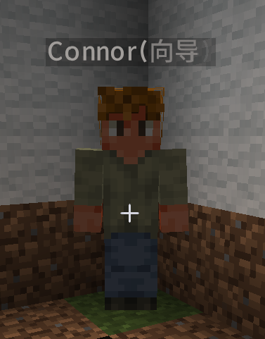

## 尝试在 Fabric 下尽力还原 Terraria 玩法

本项目的目标是在 **Minecraft Fabric** 环境中，逐步还原 **Terraria** 的核心玩法与机制。  
目前还在持续开发中
---

## 当前已实现内容

* 玩家背包与容器 **堆叠上限提升到 9999**
* **创造模式堆叠逻辑适配**
* **生命水晶** 与基础生命成长系统
* 工具 **不再消耗耐久**
* **住房检测与登记系统**
* **泰拉式睡觉时间加速**
* **向导 NPC**
* **泰拉货币系统（铜/银/金/铂）**

---

## 当前开发方向

* 继续按 Terraria 的思路扩展 **NPC 系统**
* 继续拆清 **房屋检测、入住分配、NPC 刷新规则** 的职责边界
* 逐步补齐更多 Terraria 风格的 **生命、战斗、物品、住房、NPC、世界事件** 机制

---

## 代码结构与维护说明

以后加功能时，优先往对应系统目录里放，不要把逻辑继续堆到主类或命令类里。

### 1. 公共入口

* `src/main/java/bhw/voident/xyz/terrariafabric/Terrariafabric.java`  
  模组主入口。负责注册实体、物品、命令、睡觉时间系统、NPC 刷新调度，以及玩家最大心数复制事件。

### 2. `src/main/java/bhw/voident/xyz/terrariafabric/` 目录

* `attribute/`  
  当前为空，预留给玩家/实体属性系统，例如防御、移动速度、攻速、魔力等。
* `boss/`  
  当前为空，预留给 Boss 主系统。
* `boss/ai/`  
  当前为空，预留给 Boss 阶段 AI 和行为树。
* `boss/progress/`  
  当前为空，预留给 Boss 击杀进度、世界解锁状态。
* `combat/`  
  当前为空，预留给伤害、击退、暴击、穿甲等战斗结算。
* `combat/effect/`  
  当前为空，预留给 Buff / Debuff。
* `command/`  
  存放所有指令。
* `command/GuideCommand.java`  
  `/向导` 指令。检测玩家所在房屋是否合法，并把向导绑定/搬入这间房屋。
* `command/HouseCommand.java`  
  `/checkhouse` 指令。手动执行房屋 BFS 检测，并提示“合格 / 缺少条件 / 已被占领”。
* `config/`  
  当前为空，预留给模组配置读写。
* `crafting/`  
  当前为空，预留给工作站识别和配方系统。
* `data/`  
  当前为空，预留给服务端权威数据管理。
* `entity/`  
  存放实体本体和实体注册。
* `entity/GuideEntity.java`  
  向导 NPC 实体。定义生命、防御、抗击退、攻击力、开门、回家、攻击怪物、死亡后进入待重生状态等行为。
* `entity/TerrariafabricEntities.java`  
  注册自定义实体类型，并绑定默认属性。
* `entity/boss/`  
  当前为空，预留给 Boss 实体。
* `entity/mob/`  
  当前为空，预留给普通怪物。
* `entity/projectile/`  
  当前为空，预留给投射物。
* `init/`  
  当前为空，预留给统一注册分发入口。后续注册项变多时可把 `register()` 调用收口到这里。
* `inventory/`  
  当前为空，预留给泰拉额外背包、钱币槽、弹药槽等。
* `item/`  
  存放物品逻辑和物品注册。
* `item/LifeCrystalItem.java`  
  生命水晶逻辑。使用后把玩家最大心数 +1，并按当前设定回血。
* `item/TerrariaCoinItem.java`  
  货币物品逻辑。当前支持银币手动拆分为铜币（潜行右键）。
* `item/TerrariafabricItems.java`  
  统一注册物品，并把生命水晶加入创造物品栏。
* `item/accessory/`  
  当前为空，预留给饰品系统。
* `item/consumable/`  
  当前为空，预留给药水、卷轴、召唤物等消耗品。
* `item/weapon/`  
  当前为空，预留给近战、远程、魔法、召唤武器。
* `loot/`  
  当前为空，预留给掉落表和额外掉落逻辑。
* `mixin/`  
  存放通用 Mixin 补丁。
* `mixin/ContainerMaxStackSizeMixin.java`  
  把容器接口层的最大堆叠上限改成 9999。
* `mixin/HousingBlockItemMixin.java`  
  玩家放置住房相关方块后，通知住房系统把附近房间标记为待复检。
* `mixin/InventoryAutoStackMixin.java`  
  玩家背包从存档读取后自动压缩同类物品堆叠，避免登录后同类物品被拆成很多组。
* `mixin/InventoryCoinAutoConvertMixin.java`  
  玩家背包变化时立即自动换币（覆盖拾取、Shift 放入、从容器取出）。
* `mixin/ItemStackCountCodecMixin.java`  
  放宽 ItemStack 数量的编解码上限，避免 9999 堆叠在存档/网络阶段出问题。
* `mixin/ItemStackMaxStackSizeMixin.java`  
  把普通可堆叠物品的 `ItemStack#getMaxStackSize` 抬到 9999。
* `mixin/ItemStackNoDurabilityMixin.java`  
  拦截物品耐久损耗，让工具不再掉耐久。
* `mixin/SlotMaxStackSizeMixin.java`  
  把槽位级最大堆叠上限也改到 9999，覆盖箱子、工作台、熔炉、漏斗等界面。
* `mixin/server/`  
  存放只在服务端生效的 Mixin。
* `mixin/server/PlayerMaxHeartsMixin.java`  
  给玩家挂接最大心数存档、读取和属性同步逻辑。
* `mixin/server/PlayerSleepMixin.java`  
  允许白天睡觉并维持睡眠状态，避免被原版强制弹起。
* `mixin/server/ServerPlayerGameModeHousingMixin.java`  
  玩家破坏住房相关方块后，把附近房屋标记为待复检。
* `mixin/server/ServerPlayerSleepMixin.java`  
  服务端玩家层的白天睡觉补丁与重生点设置。
* `mixin/server/SleepStatusMixin.java`  
  关闭原版睡觉直接跳夜逻辑，让自定义时间加速逻辑接管。
* `network/`  
  当前为空，预留给自定义网络包。
* `npc/`  
  存放 NPC 通用系统。
* `npc/NpcNames.java`  
  从 `data/terrariafabric/npc/names.json` 读取各 NPC 的随机名字池。
* `npc/ai/`  
  当前为空，预留给 NPC 专用 AI。
* `npc/definition/`  
  存放 NPC 定义层，每个 NPC 的特殊规则以后都放这里。
* `npc/definition/NpcDefinition.java`  
  NPC 规则接口。定义 NPC 的 id、实体类型、名字、初始生成、重生与住房使用规则。
* `npc/definition/GuideNpcDefinition.java`  
  向导的定义实现。包含世界初始刷新、默认名字、附近玩家刷新的逻辑。
* `npc/definition/NpcDefinitions.java`  
  所有 NPC 定义的统一索引表。以后加护士、商人等都从这里挂进去。
* `npc/dialog/`  
  当前为空，预留给 NPC 对话系统。
* `npc/home/`  
  存放住房系统。
* `npc/home/HouseCheckResult.java`  
  房屋检测结果对象。
* `npc/home/HouseDetector.java`  
  房屋 BFS 检测核心。只负责结构判定、边界计算、找房间内刷怪/刷 NPC 位置，不放 NPC 专属规则。
* `npc/home/HouseMessages.java`  
  把缺少门、桌子、椅子、光源等提示拼成完整消息。
* `npc/home/HouseMissing.java`  
  房屋缺失条件枚举。
* `npc/home/HouseRoom.java`  
  房间边界对象，只描述最小点和最大点。
* `npc/home/HousingDirtyQueue.java`  
  脏房锚点队列。事件驱动地只重检附近房屋，避免高频全图扫描。
* `npc/home/HousingRegistry.java`  
  房间注册表和持久化。记录房屋边界、占用 NPC、是否手动分配、是否脏、上次检测时间。
* `npc/home/HousingRelevantBlocks.java`  
  规定哪些方块变动会触发房屋重检，比如门、桌子、床、光源、实体方块等。
* `npc/shop/`  
  当前为空，预留给商店系统。
* `npc/spawn/`  
  存放 NPC 入住与刷新调度。
* `npc/spawn/NpcResidenceManager.java`  
  负责 NPC 与房间的绑定、搬家、位置修正、死亡后的待重生状态处理。
* `npc/spawn/NpcSpawnScheduler.java`  
  负责事件驱动 + 低频兜底调度。玩家进服、白天切换、相关方块变化时触发房屋/NPC 检查，不做每 tick 全图暴力扫描。
* `npc/state/`  
  存放 NPC 世界级持久化状态。
* `npc/state/NpcWorldState.java`  
  记录每个 NPC 是否已经生成过、当前实体 UUID、是否待重生。
* `player/`  
  存放玩家泰拉化基础数据。
* `player/TerrariafabricHealth.java`  
  生命系统常量。当前设定为初始 5 心、上限 20 心、每心 2 点生命值。
* `player/TerrariafabricMaxHearts.java`  
  最大心数访问接口，供物品、Mixin、事件共享。
* `player/sleep/`  
  存放睡觉相关的玩家状态接口。
* `player/sleep/DaySleepFlag.java`  
  标记玩家是否处于“白天强制睡眠”状态。
* `registry/`  
  当前为空，预留给资源 id、注册工具类和常量。
* `save/`  
  当前为空，预留给更通用的存档封装层。
* `util/`  
  当前为空，预留给通用工具。
* `world/`  
  世界系统根目录。
* `world/biome/`  
  当前为空，预留给生物群系与腐化/神圣扩散。
* `world/event/`  
  当前为空，预留给血月、日食、入侵等事件。
* `world/gen/`  
  当前为空，预留给地形、矿物、结构生成。
* `world/time/`  
  时间系统目录。
* `world/time/sleep/`  
  睡觉时间逻辑目录。
* `world/time/sleep/SleepTimeAccelerator.java`  
  实现泰拉式“睡觉加速时间”，而不是原版直接跳过整段夜晚。
* `currency/`  
  货币系统目录。
* `currency/CoinCurrencySystem.java`  
  负责击杀掉币、自动升阶换币和手动拆分后的短暂停止自动换币。

### 3. `src/client/java/bhw/voident/xyz/terrariafabric/` 目录

* `client/`  
  存放客户端入口和只在客户端运行的逻辑。
* `client/TerrariafabricClient.java`  
  客户端主入口。当前负责注册向导渲染器。
* `client/TerrariafabricDataGenerator.java`  
  Fabric Data Generator 入口。当前只创建基础数据包，后续可以往里接配方、掉落表、标签自动生成。
* `client/render/`  
  存放实体渲染器。
* `client/render/GuideRenderer.java`  
  向导 NPC 渲染器。
* `client/sound/`  
  当前为空，预留给泰拉风格音乐和环境音。
* `client/ui/`  
  当前为空，预留给生命心、魔力星、Boss 血条等 HUD。
* `mixin/`  
  客户端专用 Mixin 根目录。
* `mixin/client/`  
  当前客户端补丁都在这里。
* `mixin/client/CreativeModeInventoryScreenMixin.java`  
  适配创造模式下的 Shift 合并和中键克隆堆叠，让创造也按 9999 上限工作。

### 4. 资源目录

* `src/main/resources/fabric.mod.json`  
  模组元数据、入口点、依赖版本范围。
* `src/main/resources/terrariafabric.mixins.json`  
  服务端/通用 Mixin 配置。
* `src/client/resources/terrariafabric.client.mixins.json`  
  客户端 Mixin 配置。
* `src/main/resources/assets/terrariafabric/lang/en_us.json`  
  英文文本。
* `src/main/resources/assets/terrariafabric/lang/zh_cn.json`  
  中文文本。
* `src/main/resources/assets/terrariafabric/models/item/life_crystal.json`  
  生命水晶物品模型。
* `src/main/resources/assets/terrariafabric/models/item/copper_coin.json`  
  铜币物品模型。
* `src/main/resources/assets/terrariafabric/models/item/silver_coin.json`  
  银币物品模型。
* `src/main/resources/assets/terrariafabric/models/item/gold_coin.json`  
  金币物品模型。
* `src/main/resources/assets/terrariafabric/models/item/platinum_coin.json`  
  铂金币物品模型。
* `src/main/resources/assets/terrariafabric/textures/item/life_crystal.png`  
  生命水晶贴图。
* `src/main/resources/assets/terrariafabric/textures/item/copper_coin.png`  
  铜币贴图。
* `src/main/resources/assets/terrariafabric/textures/item/silver_coin.png`  
  银币贴图。
* `src/main/resources/assets/terrariafabric/textures/item/gold_coin.png`  
  金币贴图。
* `src/main/resources/assets/terrariafabric/textures/item/platinum_coin.png`  
  铂金币贴图。
* `src/main/resources/assets/terrariafabric/textures/entity/guide.png`  
  向导贴图。
* `src/main/resources/data/terrariafabric/npc/names.json`  
  所有 NPC 的随机名字数据文件。以后护士、商人等名字都往这里加。

### 5. 现在这套结构的维护原则

* 房屋 BFS 判定只放在 `HouseDetector`，不要把“某个 NPC 的入住条件”塞进去。
* 每个 NPC 的个性规则放在 `npc/definition/`，这样以后加护士、商人、军火商时不会污染住房系统。
* 房屋占用关系和房屋持久化只放在 `HousingRegistry`。
* NPC 是否已经生成过、是否待重生，只放在 `NpcWorldState`。
* 高频补丁只改原版行为，复杂业务逻辑优先放普通类，避免 Mixin 越写越臃肿。

---

## 更新日志

### 2026.3.28
* 在原 **sit**基础上新增 Mixin行为补丁
* 补回叠坐时的潜行下车拦截
* 台阶坐下时身体不可以跟跟着视角转动（不会有人喜欢在台阶上可以把腿伸到后面吧）
* 骑人有bug改不完，删了不写了

* 搭了 Town NPC 共用实体和条件工具，后面继续加城镇 NPC 不用再把入住条件散着写
* 先把护士 NPC 接进系统了，贴图先留空，客户端先用占位的人形渲染顶着
* 自动房屋检测改成从门、桌椅、光源附近反推房间内部起点，不再只靠玩家附近乱扫方块
* Town NPC 调度顺序收成更接近泰拉：先安置已有 homeless，再处理重生，最后才轮到新 NPC 入住

### 2026.3.26(摸鱼)
* 学习Blockbench建模

### 2026.3.25(也属于摸鱼)
* 其实啥也没干，只是把sit模组移植过来了
* 
---

### 2026.3.23(摸鱼)
* 让ai改一下已知的bug

---

### 2026.3.22
* 修正 NPC 入住提示，现在会显示具体入住的 NPC 名称
* 修正“有家可归”成就发放链路，入住时会补发根成就再触发弹窗
* 新增商人 NPC
* 添加商人入住条件
* 添加商人名字列表
* NPC 随机名现在会追加职业后缀  例如Bihrys(向导)
* 新增自动 NPC 房屋检测倒计时提示，方便调试
* 向导渲染器改为兼容玩家皮肤格式(之前图方便用的是村民hhh)
* 自动 NPC 房屋检测调试提示追加“已检测到 X 个可用房间”(调试的时候启用)
* 
---

### 2026.3.21（摸鱼ing）

* 写了一点注释
* 新增独立成就目录 `src/main/resources/data/terrariafabric/advancements/terraria/`，后续成就都从这里继续扩展
* 新增首个房屋/NPC 成就 **有家可归**：让第一个城镇 NPC 住进你的第一间有效房屋

---

### 2026.3.20（货币系统补充）

* 新增铜币、银币、金币、铂金币
* 兑换关系：`100 铜 = 1 银`，`100 银 = 1 金`，`100 金 = 1 铂`
* 铜/银/金币最大堆叠 `100`，铂金币最大堆叠 `9999`
* 击败敌对生物会掉落钱币
* 玩家背包变化时立即自动换币（覆盖拾取、Shift 放入、从容器取出）
* 新增银币手动拆分铜币：潜行右键银币

---

### 2026.3.20

* 补全主类维护注释
* 重写 README 目录结构说明
* 为当前所有实际存在的文件夹与关键文件补上职责文档，方便后续继续扩展 NPC、住房、世界系统

---

### 2026.3.19

* 修复 **向导房屋已占领但实体不可见** 的问题
* 向导入住时改为 **直接出现在房屋内**
* 补全 **护士 NPC 名字表**
* 统一 NPC 名字配置文件
* 搭建 **NPC 定义 / 房屋注册表 / 脏房队列 / 刷新调度** 架构骨架

---

### 2026.3.15

* 新增 **护士 NPC 名字**

---

### 2026.3.14

* 添加 **生命水晶**
* 工具 **不再消耗耐久**
* 加入 **向导 NPC**
* **重构部分代码结构**

---

### 2026.3.13

* 完成 **NPC 房屋检测系统**
* 实现 **Terraria 同款睡觉加速时间**
* 玩家背包 **堆叠上限提升至 9999**
* 新增 **客户端堆叠上限修正（适配创造模式）**

---
